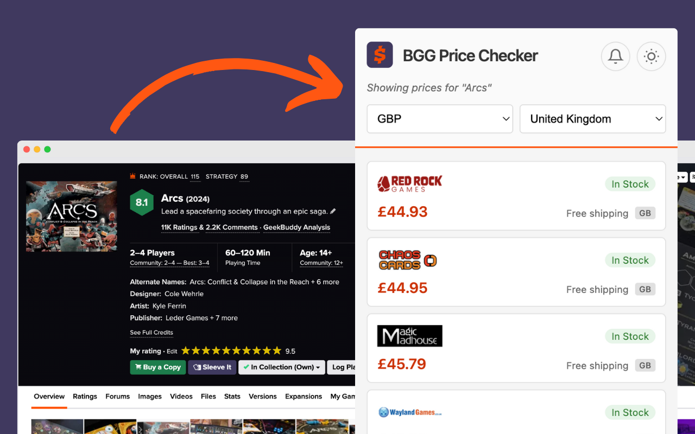

<div align="center">
  
  
  # BGG Price Checker
  
  [](https://chromewebstore.google.com/detail/bgg-price-checker/badhhgecpgddfoebdpiokchnfjadcihi)
  [](#firefox-add-ons)
  [](https://github.com/kkjdaniel/bgg-pricing-extension)
  [](LICENSE)
  [](https://boardgamegeek.com)
  
  **Find the best deal on board games instantly!** 
  
  This extension lets you compare real-time prices from multiple retailers while you browse BoardGameGeek, helping you save money on your next board game purchase.
  
  
  
  <a href="https://www.buymeacoffee.com/kkjdaniel" target="_blank"></a>
</div>

## ✨ Features

- 🎯 **Automatic Detection** - Instantly recognises when you're viewing a board game on BoardGameGeek
- 💰 **Real-time Pricing** - Shows current prices from multiple retailers
- 📦 **Shipping Included** - Displays total price including shipping costs
- ✅ **Stock Status** - Shows real-time availability
- 🌍 **Smart Localisation** - Auto-detects your region for appropriate currency and shipping destination
- ⚡ **Performance Optimised** - Caches results for 1 hour to reduce API calls
- 💱 **Multi-Currency Support** - USD, GBP, EUR, DKK, SEK

## 🚀 Installation

### Chromium Browsers (Chrome, Edge, Brave, Opera, Vivaldi)

[](https://chromewebstore.google.com/detail/bgg-price-checker/badhhgecpgddfoebdpiokchnfjadcihi)

Install the extension directly from the [Chrome Web Store](https://chromewebstore.google.com/detail/bgg-price-checker/badhhgecpgddfoebdpiokchnfjadcihi). Works with all Chromium-based browsers.

#### Manual Installation (Developer Mode)

1. Clone this repository or download the source code
2. Open Chrome and navigate to `chrome://extensions/`
3. Enable "Developer mode" using the toggle in the top right
4. Click "Load unpacked"
5. Select the `bgg-pricing-extension` directory
6. The extension icon will appear in your toolbar

### Firefox

[](#)

The Firefox version is coming soon! In the meantime, you can install it manually:

1. Download the source code
2. Build the Firefox version: `make firefox`
3. Open Firefox and navigate to `about:debugging`
4. Click "This Firefox"
5. Click "Load Temporary Add-on"
6. Navigate to the `dist` folder and select the Firefox `.zip` file

**Alternative manual method:**
1. Rename `manifest-firefox.json` to `manifest.json`
2. Open Firefox and navigate to `about:debugging`
3. Click "This Firefox"
4. Click "Load Temporary Add-on"
5. Select the `manifest.json` file from the extension directory

## 📖 Usage

1. Navigate to any BoardGameGeek game page (e.g., https://boardgamegeek.com/boardgame/13/catan)
2. Click the extension icon in your toolbar
3. View pricing information from various retailers
4. Click on any price to visit the retailer's page
5. Use the dropdown menus to change currency and shipping destination

## 🔧 Technical Details

- **API**: Uses BoardGamePrices.co.uk plugin API
- **Caching**: Stores pricing data for 1 hour per game/currency/destination combination
- **Region Detection**: Automatically sets currency based on browser locale
- **BGG ID Extraction**: Parses game ID from BoardGameGeek URLs

## 👨‍💻 Development

To modify the extension:

1. Make your changes to the source files
2. Go to `chrome://extensions/`
3. Click the refresh icon on the extension card
4. Test your changes

### Project Structurew

#### Core Files

- `manifest.json` - Chrome/Edge extension manifest (Manifest V3)
- `manifest-firefox.json` - Firefox extension manifest (Manifest V2)
- `constants.js` - Shared constants across all scripts
- `content.js` - Runs on BGG pages to detect game IDs and update badge
- `background.js` - Service worker handling badge updates and data caching
- `popup.js` - Main logic for the extension popup UI
- `popup.html` - Extension popup interface
- `popup.css` - Styling including dark mode support

### Building for Distribution

The build process creates platform-specific packages:

```bash
make chrome   # Creates Chrome package in dist/
make firefox  # Creates Firefox package in dist/
make all      # Builds both Chrome and Firefox packages
make clean    # Removes dist directory
make help     # Shows all available commands
```

#### Build Output

- Chrome: `dist/bgg-price-checker-chrome-v{version}.zip`
- Firefox: `dist/bgg-price-checker-firefox-v{version}.zip`

The Firefox build automatically uses `manifest-firefox.json` and renames it to `manifest.json` inside the package.

### Browser API Compatibility

The extension uses a unified API approach to support both Chrome and Firefox:

```javascript
const api = typeof browser !== "undefined" ? browser : chrome;
```

This ensures all storage, tabs, and runtime APIs work correctly across browsers.

## 🤝 Contributing

Contributions are welcome! Please feel free to submit a Pull Request.

## ⚖️ Disclaimer

This extension is an independent project and is not affiliated with, endorsed by, or connected to BoardGameGeek (BGG). All trademarks and service marks belong to their respective owners.
